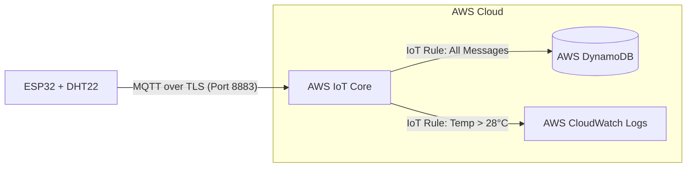

** Архітектура проекту:
Система побудована за безсерверною (Serverless) IoT-архітектурою із забезпеченням сквозного шифрування даних:

1. **Збір даних (Hardware Layer):**
   * Мікроконтролер **ESP32** зчитує показники температури та вологості з цифрового датчика **DHT22**.
   * Дані формуються у форматі JSON (Payload) з міткою часу.

2. **Передача даних (Transport & Security Layer):**
   * ESP32 підключається до **AWS IoT Core** через протокол **MQTT** поверх **TLS 1.2** (використовується взаємна автентифікація за допомогою унікальних X.509 клієнтських сертифікатів).
   * Дані публікуються у визначений топік: `iot-course/<name>/sensors/data`.

3. **Маршрутизація та обробка (AWS IoT Rules Engine):**
   * **Збереження телеметрії:** IoT Rule перехоплює всі вхідні повідомлення з топіку та через екшн автоматично заносує їх до безсерверної бази даних **AWS DynamoDB**.
   * **Алертинг та моніторинг:** Окреме IoT Rule з SQL-фільтром (`WHERE temperature > 28`) відстежує критичні значення. У разі перевищення порогу $28^\circ\text{C}$ подія фіксується в лог-стрімі **AWS CloudWatch Logs**.

Фото елементів з таблиці DynamoDB:

** Фото логів з таблиці CloudWatch:

** Фото вмісту одного з логів:

